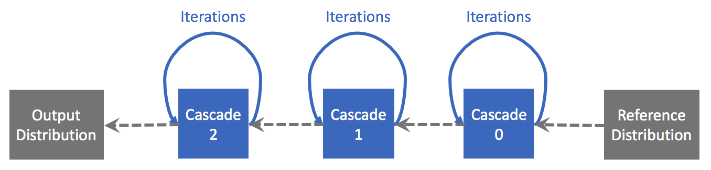
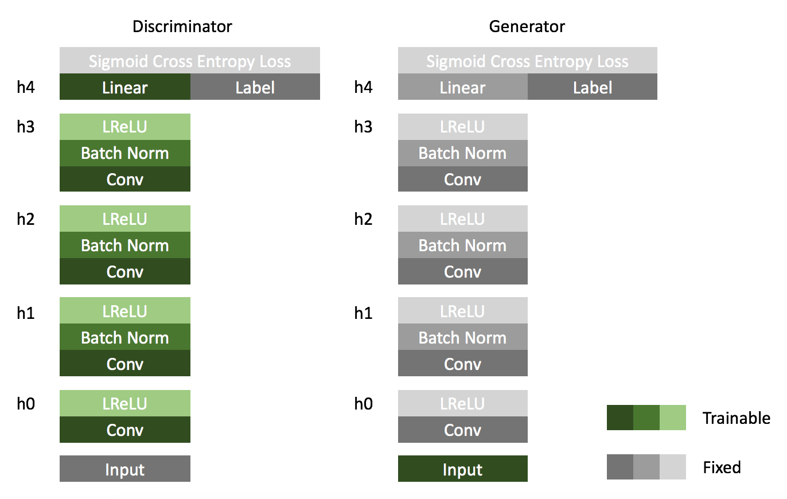

## Quick Look at SimpleINNg

This tutorial is based on SimpleINNg v1.

#### Outline

At first, some simple **reference distribution** is used to generate initial negative images. Afterwards, the positive images and initial negative images are fed into a series of cascades to train the model. Finally, we draw images from **output distribution**, which are the generated images of cascade actually.

#### Cascade and Iteration

One **cascade** means one independent model. In the training process for each cascade, there are several **iterations**. In each iteration, we train the discriminator at first, then use the generator to generate new negative images. Several batches are taken in discriminator and generator training.

#### Discriminator and Generator

In discriminator, **all hidden layers** (i.e. h0, h1, h2, h3, h4) in the networks are trainable. In generator, **only input layer** is trainable while all hidden layers are frozen.
